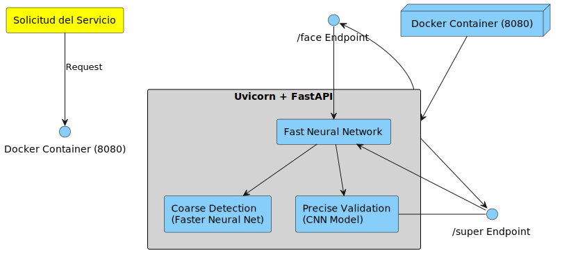

# Despliegue de modelos

## Infraestructura

- **Nombre del modelo:** img_super
- **Plataforma de despliegue:** La infraestructura utilizada para el despliegue del modelo "img_super" se basa en contenedores Docker y se implementa mediante la plataforma Uvicorn y FastAPI.
- **Requisitos técnicos:**  Los archivos relevantes para la configuración de la infraestructura se encuentran en las siguientes rutas dentro del proyecto:

Dockerfile: El archivo Dockerfile se encuentra en la ruta \src\img_super\Dockerfile. Este archivo contiene las instrucciones necesarias para construir la imagen del contenedor. En este caso, se utiliza la imagen base de Python 3.11-slim y se instalan las dependencias necesarias, como FastAPI, TensorFlow y otras bibliotecas requeridas por el modelo.

requirements.txt: El archivo requirements.txt se encuentra en la ruta \src\img_super\requirements.txt. Este archivo enumera las dependencias y versiones específicas que deben instalarse en el entorno del contenedor. Al construir la imagen del contenedor, se utiliza este archivo para instalar las bibliotecas necesarias, como FastAPI, TensorFlow y otras dependencias.
- **Diagrama de arquitectura:**

Diagrama de REST del servicio:


Diagrama de despliegue y funcionamiento del servicio:


## Código de despliegue

- **Archivo principal:** `Dockerfile`
- **Rutas de acceso a los archivos:**
  - Ruta del archivo Dockerfile: `/src/img_super/Dockerfile`
  - Ruta del archivo `requirements.txt`: `/src/img_super/requirements.txt`
  - Ruta del archivo principal `main.py`: `/src/img_super/main.py`
  - Ruta del archivo de prueba `test.py`: `/src/img_super/test/test.py`

- **Variables de entorno:** No se requieren variables de entorno adicionales en este caso.

## Documentación del despliegue

- **Instrucciones de instalación:**
  1. Asegúrate de tener Docker instalado en tu sistema.
  2. Clona el repositorio que contiene el código del modelo.
  3. Navega hasta el directorio raíz del proyecto.
  4. Abre una terminal o línea de comandos en ese directorio.
  5. Construye la imagen del contenedor ejecutando el siguiente comando:
     ```
     docker build -t img_super_app /src/img_super
     ```
  6. Espera a que se complete la construcción de la imagen.
  7. Una vez construida la imagen, crea y ejecuta el contenedor con el siguiente comando:
     ```
     docker run -d -p 8080:8080 --name img_super_app img_super_app
     ```

- **Instrucciones de configuración:** No se requieren configuraciones adicionales en este caso.

- **Instrucciones de uso:**
  1. Asegúrate de tener una imagen en el formato admitido (JPEG, PNG, etc.) para probar el servicio.
   2. Ejecuta el script `test.py` en una terminal o línea de comandos, proporcionando la ruta de la imagen y la URL del servicio FastAPI como argumentos. Por ejemplo:
     ```
     python /src/img_super/test/test.py /path/to/image.jpg http://localhost:8080/super
     ```
     puede ejecutar
     ```
     python src/img_super/evaluation/test_post.py src/img_super/evaluation/test-real.png http://localhost:8080/super
     ```

  3. Reemplaza `/path/to/image.jpg` con la ruta de la imagen que deseas enviar y `http://localhost:8080/super` con la URL del servicio FastAPI correspondiente.
  4. El script enviará la imagen al servicio y mostrará la respuesta en formato JSON.

- **Instrucciones de mantenimiento:** No se requieren instrucciones adicionales de mantenimiento en este caso.
